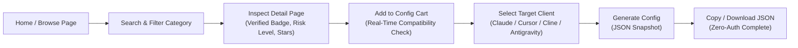
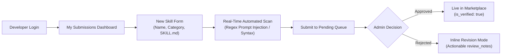

# ContextForge — UX Specification (UX.md)
<!-- Grounded in Impeccable Design System, WCAG 2.2 AA, and Anti-AI-Slop Engineering -->

## 1. Executive Summary & Design Vision

ContextForge is a precision, data-dense engineering registry for AI Agents, MCP Servers, and AI Skills.  
Its UX philosophy follows **"Blueprint Scratched into Obsidian"**:
- **Zero AI-Slop**: No gratuitous floating 3D glass balls, no neon purple/cyan gradient borders, and no vague marketing fluff.
- **Data-Dense Editorial Utility**: Fast, keyboard-accessible, clear visual hierarchy, and instant feedback.
- **Dual-Citizen Parity**: MCP Tools and AI Skills are treated with equal visual weight, distinguished by unambiguous semantic indicators.

---

## 2. User Journeys (By Persona)

### Persona A: General AI User / Consumer (Zero-Auth Discovery Journey)
**Goal:** Discover extensions, evaluate safety risk, and generate a client config in <60 seconds without logging in.

- **Step 1: Unauthenticated Discovery**: Lands on Browse view showcasing Curated Top 10 Skills & Verified MCP Tools.
- **Step 2: Instant Filter & Search**: Real-time keyword search and category filters (e.g., `#database`, `#code-review`, `#browser`).
- **Step 3: Asset Inspection**: Reviews detail modal or page:
  - Trust signals: Verified Badge, GitHub Stars (cached), Contributor count.
  - Security signals: Risk Level (`read_only`, `network`, `filesystem`, `destructive`) with human-readable rationale.
  - Parameter preview: Required environment variables (masked names only).
- **Step 4: Config Cart**: Clicks "Add to Config Cart".
  - **Critical Drop-Off Prevention**: Real-time compatibility warning if a selected skill or tool is incompatible with the chosen target client (e.g., Claude Desktop vs Antigravity). Warnings trigger *before* generation, never after.
- **Step 5: Unified Generation**: Selects client target ➔ clicks "Generate Config" ➔ Copy to Clipboard or Download `.json` file. No account required.

---

### Persona B: Custom Skill Developer (Authoring & Immediate Feedback)
**Goal:** Submit a custom `SKILL.md` instruction pack with instant security scanning and clear review tracking.

- **Step 1: Submission**: Enters name, description, client compatibility tags, and pastes raw `SKILL.md` content.
- **Step 2: Pre-Flight Safety Scan**: The client-side / edge scanner validates structure and highlights potential indirect prompt injection phrases (e.g., hidden exfiltration webhooks) in real time before submission.
- **Step 3: Submission & Tracking**: Enters `pending` queue in `submission_reviews`.
- **Step 4: Rejection & Resubmission**: If rejected by Admin, the developer receives the exact `review_notes` and can edit and resubmit directly in-place without creating a duplicate record.

---

### Persona C: Open Source Maintainer (GitHub 1-Click Import)
**Goal:** Register an existing public MCP server or Skill repo with zero redundant data entry.

- **Step 1: URL Intake**: Pastes public GitHub URL (`https://github.com/owner/repo`).
- **Step 2: Automatic Scrape & Hydration**: Backend fetches README, star counts, contributor count, and license via authenticated GitHub API worker.
- **Step 3: Dev Review**: Maintainer verifies extracted commands, specifies `required_env_vars` (e.g., `POSTGRES_URL`), selects tool risk level, and submits to review queue.

---

### Persona D: Platform Admin (High-Throughput Governance Queue)
**Goal:** Triage community submissions rapidly with risk prioritization and zero cognitive clutter.

- **Step 1: Prioritized Queue**: Admin Dashboard automatically sorts items:
  1. `flagged_by_scan = true` (Urgent security risk)
  2. Longest waiting pending submissions
- **Step 2: Dual-Pane Inspection**:
  - Left pane: Full Markdown content / Tool schema diff.
  - Right pane: Scan warnings, risk matrix, author reputation.
- **Step 3: Deterministic Action**:
  - **Approve**: 1-click approve flushes transaction, flips `is_verified = true`, notifies developer.
  - **Reject**: Rejection requires selecting or typing structured `review_notes` (e.g., "Missing required_env_vars description").

---

## 3. Responsive Layout & Viewport Ergonomics

**Primary Surface Principle:** Desktop (≥1024px) is the primary work environment for developers and administrators. Mobile (<768px) is optimized for discovery, reading, and config generation.

| Layout Area | Desktop (≥ 1024px) | Mobile (< 768px) |
| :--- | :--- | :--- |
| **Browse Grid** | 3-Column Responsive Grid with compact 1px hairline border cards. | 1-Column vertical card stack, full width, 16px touch padding. |
| **Detail View** | 2-Column Split: Content/Markdown (65% left) + Sticky Metadata/Risk Sidebar (35% right). | 1-Column Stack: Badges, Risk Level, and CTA pinned to top before reading full content. |
| **Config Builder** | Persistent floating Right Rail sidebar showing active cart while scrolling. | Bottom Sheet drawer pulled up on demand; Sticky "Review & Generate" bottom CTA bar. |
| **Admin Table** | Full-width dense data table with keyboard navigation, inline diffs, and filter pills. | Compact summary card view showing pending count + link to desktop view. |

---

## 4. Voice, Tone & Actionable Empty States

All empty states communicate with the system's authoritative, technical voice. **Never use generic apologies or blank "No data found" notices.**

| Situation | System Heading | Context Explanation | Primary Actionable CTA |
| :--- | :--- | :--- | :--- |
| **Search Yields No Matches** | "No matching extensions found" | "No verified tools or skills matched your filter criteria." | `[Clear Filters]` Button |
| **Developer Has No Submissions** | "No registered submissions" | "You have not published any MCP servers or AI skills to ContextForge." | `[Submit Your First Item]` Button |
| **Empty Config Cart** | "Config cart is empty" | "Select verified MCP tools or skills from the catalog to compile your setup." | `[Browse Registry]` Button |
| **Admin Queue Cleared** | "Review queue cleared" | "All pending submissions have been triaged. No security items pending." | *No CTA required — this is an optimal operational state.* |
| **Skill Submission Rejected** | "Submission rejected" | "Reviewer feedback: `[review_notes]`" | `[Edit & Resubmit]` Button |

---

## 5. WCAG 2.2 AA Accessibility Specification

1. **Contrast Ratio Invariants**:
   - Primary text (Chalk `#f3f3f3` on Obsidian `#101010`): **16.2:1** (Exceeds 4.5:1 requirement).
   - Secondary text (Smoke `#9c9c9c` on Obsidian `#101010`): **4.8:1** (Exceeds 4.5:1 requirement).
   - Badges on dark surfaces must maintain a minimum 4.5:1 ratio against their container fills.
2. **Multi-Signal Information Design**:
   - **Never rely on color alone**: Every risk indicator pairs an iconic glyph with explicit text:
     - `🟢 read_only` (Read-Only)
     - `🔵 network` (Network Access)
     - `🟡 filesystem` (Local Filesystem)
     - `🔴 write_destructive` (Destructive / Shell Execution)
3. **Keyboard Navigation & Focus Invariants**:
   - Logical tab-stops across all cards, filters, and modals.
   - Visible outline focus ring: `outline: 2px solid var(--color-chalk); outline-offset: 2px;` (Never `outline: none` without replacement).
4. **ARIA & Assistive Attributes**:
   - Star badges: `aria-label="1,250 GitHub stars"`.
   - Download badges: `aria-label="8,400 downloads"`.
   - Dynamic cart updates use `aria-live="polite"`.
5. **Form Error Association**:
   - Input validation errors must bind to their input element via `aria-describedby="field-error-id"`, never color-only red borders.
6. **Motion & Zoom Resilience**:
   - `@media (prefers-reduced-motion: reduce)` disables all transition transforms and entry animations.
   - Text layout remains fully legible and functional up to **200% zoom**.
